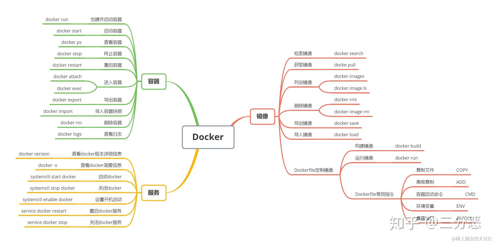

# docker

Docker🐳 是一种容器技术，只隔离应用程序的运行时环境但容器之间可以共享同一个操作系统，可以理解成一个更轻量级的 虚拟机 并且使用的是本机的操作系统。

Docker 变得越来越流行，它可以轻便灵活地隔离环境，进行扩容，运维管理。对于业务开发者而言，随着持续集成的发展，对代码质量及快速迭代的要求也越来越高。

对于前端而言，在 CI 环境中使用也更容易集成开发，测试与部署。比如可以为流水线(Pipeline)设置 Lint/Test/Security/Audit/Deploy/Artifact 等任务，更好地把控项目质量。

## 基础概念

镜像（Image）：Docker 镜像（Image）可以简单理解为一个特殊的文件系统，除了提供容器运行时所需的程序、库、资源、配置等文件外，还包含了一些为运行时准备的一些配置参数（如匿名卷、环境变量、用户等）。

容器（Container）：容器（Container）可以简单理解为一个进程，但与普通的进程不同的是，容器进程运行于一个隔离的环境中，使用的是镜像（Image）中提供的程序、库、资源、配置等文件。

仓库（Repository）：仓库（Repository）可以简单理解为代码的集中存放地，存放着镜像。一个仓库可以包含多个镜像，每个镜像有不同的标签（tag）。

注册服务器（Registry）：注册服务器（Registry）可以简单理解为代码的远程仓库，用来存放镜像。

Docker Hub：Docker Hub 是 Docker 官方推出的公有镜像仓库，用户可以将自己创建的镜像上传到 Docker Hub，供他人下载使用。

## 换源

首先打开 Docker 的设置，选择 Docker Engine,在其中输入(这里使用的是 163 的源，如果想要使用其他源可以自行设置，github 上有个项目 docker_mirror 可以自动检测在你的网络环境下哪个源是最快的)。

```json
{
  "registry-mirrors": [
    "http://hub-mirror.c.163.com",
    "https://docker.mirrors.ustc.edu.cn"
  ],
  "insecure-registries": [],
  "debug": true,
  "experimental": false
}
```

## dockerfile

Dockerfile 是用来构建镜像的配置文件，通过 Dockerfile 可以指定镜像的基础镜像，配置镜像的操作系统及软件，并可以将软件打包到镜像中。

Dockerfile 由一系列命令和参数组成，每一条命令都是构建镜像的一部分，通过这些命令可以创建镜像。

Dockerfile 指令：

```bash
# 说明该镜像以哪个镜像为基础
FROM centos:latest

# 构建者的基本信息
MAINTAINER fe

# 在build这个镜像时执行的操作
RUN yum update
RUN yum install -y git

# 拷贝本地文件到镜像中
COPY ./* /usr/share/gitdir/

# FROM：指定基础镜像
# RUN：容器构建时需要运行的命令
# EXPOSE：当前容器对外暴露的端口号
# WORKDIR：指定在创建容器后，终端默认登录进来的工作目录
# ADD：将宿主机目录下的文件拷贝进镜像，ADD命令会自动处理URL和解压tar压缩包
# CMD：指定一个容器启动时要运行的命令，参数为数组格式 CMD ["可执行文件", "参数1", "参数2" ...]

```

有了 Dockerfile 之后，就可以利用 build 命令构建镜像了：（其中-t 用来指定新镜像的用户信息、tag 等。最后的点表示在当前目录寻找 Dockerfile。）

对 Docker 操作：（Linux 下，Windows 下直接打开 Docker Desktop 即可）

```bash
# 启动docker
sudo service docker start
# 重启docker
sudo service docker restart
# 停止docker
sudo service docker stop
```



## 本地部署

借助 Docker 在本地部署前端项目实际上就是利用 Container 容器将使用不同版本应用（node，nginx，mysql 等应用）的项目隔离后进行项目的启动，避免因同一个主机安装多个不同版本应用及其切换带来的工作量及风险。

前面说到，dockerfile 是一个镜像构建文本文件, 里面包含了一系列的指令, 这些指令告诉 Docker 如何创建一个容器镜像。 在文件中可以用指令指定提供容器运行时所需要的程序，库，资源，配置等文件， 还包含了一些运行时准备的配置参数（环境变量，用户等）。

要上线一个前端项目，需要先构建打包，然后再部署。因为构建需要用到 node 环境，我们先使用 node 基础镜像来执行构建阶段,，最后将构建阶段的产物放到 nginx 来部署（多阶构建，可以减小最终镜像的大小）。 编写 dockerfile 的内容就可按照这个步骤来
在项目根目录下新建一个 dockerfile 文件, 内容如下：

```bash
# 使用 Node.js 16 作为基础镜像
FROM node:16

# 将当前工作目录设置为/app
WORKDIR /app

# 将 package.json 和 package-lock.json 复制到 /app 目录下
COPY package*.json ./

# 运行 npm install 安装依赖
RUN npm install

# 将源代码复制到 /app 目录下
COPY . .

# 打包构建
RUN npm run build

# 将构建后的代码复制到 nginx 镜像中
FROM nginx:latest
COPY --from=0 /app/dist /usr/share/nginx/html

# 暴露容器的 8080 端口，此处其实只是一个声明作用，不写的话也可以，后面运行容器的
# docker run --name container_name -p <host_port>:<container_port>命令中container_port可以覆盖此处的声明，不写就默认80端口
EXPOSE 8080

# 启动 nginx 服务
CMD ["nginx", "-g", "daemon off;"]
```

这里之所以先把 package.json 文件复制到容器中执行 npm install, 再把源码复制到容器，是因为一行指令为单独的一层，docker 会把每一层单独存储，每一次构建都是从变化的那一层开始构建，如果 package.json 文件没有变化, 那么就不会执行 install, 如果一次性把所有文件复制进去，源代码每次都会有修改，每次都会执行 npm install。

构建镜像：

```bash
docker build -t nginx-demo.

# docker build -t <image_name>:<tag> .
# docker build -t vite-react-ts-template-image:v1 .
# -t 标记镜像的名字和标签（自定义，例如**docker build -t vite-react-ts-template-image:v1 . **）
# . 表示从当前目录查找dockerfile来构建镜像
# 为了避免node_modules目录被打包进镜像，我们需要在构建镜像时，将其排除在外。
#根目录下添加.dockerignore文件，内容添加`node_modules`
#然后就可以构建镜像了：

```

运行容器

```bash
# 构建运行容器
# --name 指定容器名称为 vite-react-ts-template-container
# -p 指定外部端 8080 于容器内 8080端口连接，从而可以通过主机的 8080 端口来访问容器内的服务，要记得<container_port>这个端口被nginx监听到，因为nginx默认监听80端口而已
# -v 代表绑定卷 也就是本地的 dist 文件如果变更 容器内的 dist文件也会做出相应改变
# 注意 -v 两侧均需要使用绝对路径
# -d 表示在后台运行
# 最后的 vite-react-ts-template-image:v1 表示使用指定的镜像
# docker run --name container_name -p <host_port>:<container_port> -v <path> -d <image_name>:<tag>
docker run --name vite-react-ts-template-container -p 8080:8080 -v D:\StudySoft\VSCode\VSCodeFile\vite-react-ts-template -d vite-react-ts-template-image:v1

```

## 常用命令

### 镜像相关

- `docker pull [选项] [镜像名]`：从仓库下载镜像。
- `docker images [选项]`：列出本地镜像。
- `docker rmi [选项] <镜像1> [<镜像2>...]`：删除镜像。
- `docker tag [选项] <镜像> <别名>`：为镜像添加别名。
- `docker build [选项] <上下文路径/URL/-> [目录]`：使用 Dockerfile 创建镜像。
- `docker commit [选项] <容器 ID> [<仓库名>[]]
- `docker run [选项] <镜像> [命令] [参数]`：运行一个容器。
- `docker run [选项] -d <镜像> [命令] [参数]`：后台运行一个容器。
- `docker run [选项] --rm <镜像> [命令] [参数]`：自动删除容器。
- `docker run [选项] -it <镜像> [命令] [参数]`
- `docker run [选项] -p <宿主端口>:<容器端口> <镜像> [命令] [参数]`：将容器的端口映射到宿主的端口。
- `docker run [选项] -v <宿主路径>:<容器路径> <镜像> [命令] [参数]`：将宿主路径挂载到容器路径。

### 容器相关

- `docker ps [选项]`：列出本地容器。
- `docker ps -a [选项]`：列出本地所有容器，包括未运行的。
- `docker stop [选项] <容器ID>`：停止一个运行中的容器。
- `docker rm [选项] <容器ID>`：删除一个容器。
- `docker rm -f $(docker ps -a -q)`：删除所有容器。
- `docker exec [选项] <容器ID> <命令>`：在一个正在运行的容器中执行命令。
- `docker start [选项] <容器ID>`：启动一个已停止的容器。
- `docker restart [选项] <容器ID>`：重启一个运行中的容器。

### 仓库相关

- `docker login [选项] [服务器地址]`：登录 Docker 仓库。
- `docker logout [选项] [服务器地址]`：退出 Docker 仓库。
- `docker search [选项] [关键字]`：搜索 Docker Hub。
- `docker push [选项] <镜像>`：将镜像上传到 Docker Hub。

## 参考资料

- [Docker 官方文档](https://docs.docker.com/)
- [Docker 入门教程](https://yeasy.gitbooks.io/docker_practice/content/)
- [Docker 实战](https://yeasy.gitbooks.io/docker_practice/content/introduction/what.html)
