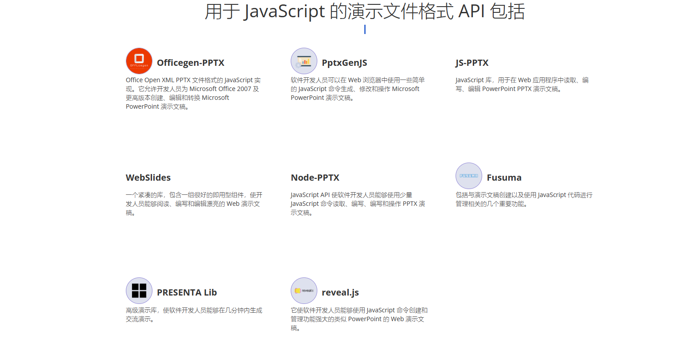

# 在线文档编辑

## word

富文本编辑器，转 html，再转 word

## excel

x-sheet 库，luckysheet

再用 xlsx 库导出 excel 文件

## ppt

pptxjs 库： jQuery plugin for convertation pptx to html using pure javascript.
PptxGenJS ： 可以添加 ppt 的一些内容
pptist
reveal.js https://revealjs.com/ 自带编辑器
\Officegen https://github.com/Ziv-Barber/officegen

<https://products.fileformat.com/zh/presentation/javascript/>

CollaboraOnline

CollaboraOnline/OnlyOffice/OpenOffice/LibreOffice

## office 预览方案

|      文档格式      |         老的开源组件         |          替代开源组件           |
| :----------------: | :--------------------------: | :-----------------------------: |
|    word（docx）    |           mammoth            |        docx-preview(npm)        |
| powerpoint（pptx） |            pptxjs            |         pptxjs 改造开发         |
|   excel（xlsx）    |    sheetjs、handsontable     | exceljs(npm)、handsontable(npm) |
|     pdf（pdf）     |            pdfjs             |           pdfjs(npm)            |
|        图片        | jquery.verySimpleImageViewer |          v-viewer(npm)          |

## 参考

<https://blog.csdn.net/wybaby168/article/details/122842866>
